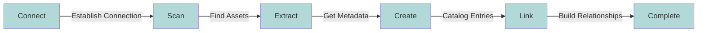

# Metadata Import (MDI)

This guide explains how to perform Metadata Import (MDI) to discover and catalog your data assets from watsonx.data into IBM Knowledge Catalog (IKC).

## Understanding Metadata Import

### What is MDI?

!!! abstract "MDI Overview"
    Metadata Import (MDI) is a powerful discovery process that automatically catalogs and organizes your data assets.

-   :material-database-search:{ .lg .middle } __Asset Discovery__

    ---

    Automatically scans and identifies data assets in watsonx.data
    
    [:octicons-arrow-right-24: Learn more](#watsonxdata-asset-types)

-   :material-database-import:{ .lg .middle } __Metadata Capture__

    ---
    
    Extracts and records technical metadata about your assets
    
    [:octicons-arrow-right-24: See details](#review-technical-metadata)

-   :material-book-lock:{ .lg .middle } __Governance__

    ---

    Enables data protection and governance features
    
    [:octicons-arrow-right-24: Explore governance](#next-steps)

-   :material-clock-fast:{ .lg .middle } __Automation__

    ---

    Saves time through automated asset registration
    
    [:octicons-arrow-right-24: Setup guide](#setting-up-mdi)

### Key Benefits

=== ":material-robot: Automated Discovery"
    Automatically finds and catalogs data assets, eliminating manual work
    
=== ":material-shield-lock: Governance"
    Creates the foundation for implementing data protection
    
=== ":material-clock-check: Time Saving"
    Eliminates manual asset registration and reduces errors
    
=== ":material-check-all: Consistency"
    Ensures uniform metadata capture across all assets
    
=== ":material-gavel: Compliance"
    Helps track and protect sensitive data effectively

### watsonx.data Asset Types

!!! example "Discoverable Assets"
    MDI can discover these types of assets in watsonx.data:

    === "Data Structures"
        - [x] Catalogs
        - [x] Schemas
        - [x] Tables (Hive, Iceberg, Delta Lake)
        - [x] Views

    === "Metadata"
        - [x] Columns and data types
        - [x] Primary/Foreign key relationships
        - [x] Access permissions

## Setting Up MDI

### Step 1: Launch MDI

!!! tip "Getting Started"
    Follow these steps to begin your metadata import journey:

    1. Navigate to the MDI section
    2. Select "New Import"
    3. Choose your source

=== "Select MDI"
    

=== "Configure Import"
    

=== "Review Settings"
    

### Step 2: Discovery Process

## Connection Setup

### Select Your Connection

!!! note "Connection Setup"
    Choose and configure your watsonx.data connection:

=== "Connection Selection"
    

=== "Connection Details"
    

### Connection Requirements

!!! warning "Prerequisites"
    Ensure you have all required components for successful MDI:

    - [x] Valid watsonx.data connection
    - [x] Appropriate access permissions
    - [x] Network connectivity
    - [x] Required SSL certificates (if applicable)

## Define Import Scope

### Configure Scope

!!! tip "Scope Configuration"
    Define what you want to discover:

=== "Scope Settings"
    

=== "Asset Selection"
    

### Available Scope Options

-   :material-database:{ .lg .middle } __Catalogs__

    ---

    Import entire catalogs at once
    
-   :material-folder-table:{ .lg .middle } __Schemas__

    ---
    
    Select specific database schemas
    
-   :material-table:{ .lg .middle } __Tables__

    ---

    Choose individual tables and views
    
-   :material-table-column:{ .lg .middle } __Columns__

    ---

    Detailed column-level metadata

## Schedule Import Job

### Configure Schedule

!!! example "Scheduling Options"
    Choose the timing that works best for your needs:

=== "Basic Schedule"
    

=== "Advanced Options"
    

=== "Final Review"
    

### Schedule Types

-   :material-clock-outline:{ .lg .middle } __One-time__

    ---

    Single import execution
    
-   :material-refresh:{ .lg .middle } __Recurring__

    ---
    
    Regular automated imports
    
-   :material-clock-edit:{ .lg .middle } __Custom__

    ---

    Tailored schedule intervals
    
-   :material-earth:{ .lg .middle } __Time Zone__

    ---

    Timezone-specific scheduling

## Verification Process

### Check Import Results

!!! success "Verification Steps"
    After import completion, verify your results:

=== "Table View"
    

=== "Profile View"
    

=== "Detailed View"
    

### Verification Checklist

-   :material-checkbox-marked:{ .lg .middle } __Asset Discovery__

    ---

    - Verify all selected assets
    - Confirm metadata accuracy
    - Check relationships
    
-   :material-database-check:{ .lg .middle } __Technical Metadata__

    ---
    
    - Table and column names
    - Data types
    - Key relationships
    - Access patterns
    
-   :material-book-check:{ .lg .middle } __Catalog Entries__

    ---

    - Asset visibility
    - Metadata completeness
    - Classification status

## Best Practices

### Implementation Guide

=== ":material-clipboard-check: Pre-Import"
    - Review source assets
    - Plan discovery scope
    - Prepare permissions
    - Document expectations

=== ":material-progress-check: During Import"
    - Monitor progress
    - Check for errors
    - Verify connectivity
    - Track resources

=== ":material-checkbox-marked-circle: Post-Import"
    - Validate assets
    - Review metadata
    - Check missing items
    - Document issues

## Troubleshooting

### Common Issues and Solutions

!!! warning "Known Issues"
    Here's how to handle common problems:

    === "Connection Problems"
        - Check network connectivity
        - Verify credentials
        - Validate SSL certificates
        - Review permissions

    === "Discovery Issues"
        - Verify asset accessibility
        - Check scope settings
        - Review error logs
        - Validate source status

    === "Metadata Issues"
        - Check incomplete metadata
        - Verify relationships
        - Review data types
        - Check encoding

## Next Steps

!!! success "Post-Import Actions"
    After completing your MDI setup:

    1. [:material-checkbox-marked-circle: Review discovered assets](#verification-process)
    2. [:material-database-check: Plan metadata enrichment (MDE)](metadata-enrichment.md)
    3. [:material-shield-lock: Configure governance rules](rules-policies.md)
    4. [:material-security: Set up data protection](rules-policies.md)

## References

-   :material-book:{ .lg .middle } __Documentation__

    ---

    [:octicons-link-external-24: IBM Knowledge Catalog Documentation](https://cloud.ibm.com/docs/data-catalog){ .md-button }

-   :material-link:{ .lg .middle } __Integration__

    ---
    
    [:octicons-link-external-24: watsonx.data Integration Guide](https://cloud.ibm.com/docs/watsonxdata?topic=watsonxdata-ikc_integration){ .md-button }

-   :material-school:{ .lg .middle } __Best Practices__

    ---

    [:octicons-link-external-24: Metadata Discovery Best Practices](https://www.ibm.com/docs/en/cloud-paks/cp-data/4.6.x?topic=catalog-discovering-data-assets){ .md-button }

