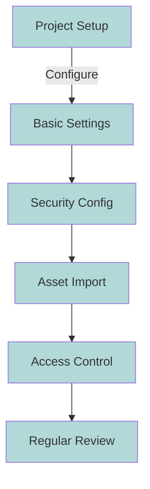

# Project Management

This guide explains how to create and manage projects for your data masking implementation.

## Overview

-   :material-folder-plus:{ .lg .middle } __Create Projects__

    ---

    Set up new projects with proper configuration
    
    [:octicons-arrow-right-24: Create now](#creating-a-new-project)

-   :material-cog:{ .lg .middle } __Configure__

    ---
    
    Configure project settings and security
    
    [:octicons-arrow-right-24: Configure](#project-configuration)

-   :material-database:{ .lg .middle } __Manage Assets__

    ---

    Import and organize your data assets
    
    [:octicons-arrow-right-24: Learn more](#working-with-assets)

-   :material-check-circle:{ .lg .middle } __Best Practices__

    ---

    Follow recommended guidelines
    
    [:octicons-arrow-right-24: View guidelines](#best-practices)

## Creating a New Project

!!! tip "Quick Start"
    Get started by creating a new project in just a few steps

### Step 1: Create Project

1. Navigate to [:octicons-link-external-24: Projects](https://eu-de.dataplatform.cloud.ibm.com/projects/new-project?context=cpdaas)
2. Click "New Project" and configure settings:

=== "Project Creation"
    

### Step 2: Add Assets

Once your project is created, you can start adding assets:

=== "Asset Creation"
    

## Project Configuration

### Basic Settings

-   :material-form-textbox:{ .lg .middle } __Project Details__

    ---
    
    - Project name
    - Description
    - Storage allocation
    - Access control

-   :material-shield-lock:{ .lg .middle } __Security__

    ---
    
    - Enable data protection
    - Configure permissions
    - Set collaboration rules

-   :material-database-cog:{ .lg .middle } __Asset Settings__

    ---
    
    - Import assets
    - Organize data
    - Manage connections

### Configuration Guide

!!! example "Setup Steps"

    === "1. Basic Configuration"
        1. Choose a descriptive project name
        2. Add detailed description
        3. Set storage limits
        4. Configure basic access

    === "2. Security Setup"
        1. Enable "Enforce data protection rules"
        2. Set up access permissions
        3. Configure collaboration settings

    === "3. Asset Management"
        1. Import required assets
        2. Organize data structure
        3. Set up connections

## Working with Assets

### Asset Management

After MDI import, you'll have access to all your data objects:

### Asset Organization

=== "Naming Conventions"
    - Use clear, descriptive names
    - Follow consistent patterns
    - Include version information
    - Add relevant prefixes

=== "Access Control"
    - Set appropriate permissions
    - Define user roles
    - Configure sharing settings
    - Monitor access logs

=== "Maintenance"
    - Regular reviews
    - Update metadata
    - Archive unused assets
    - Document changes

## Best Practices

!!! tip "Recommended Guidelines"

    === "Project Setup"
        - [x] Use clear naming conventions
        - [x] Document project purpose
        - [x] Set appropriate storage
        - [x] Configure backup settings

    === "Security"
        - [x] Implement proper access controls
        - [x] Enable data protection
        - [x] Review permissions regularly
        - [x] Monitor security logs

    === "Asset Management"
        - [x] Regular asset review
        - [x] Document changes
        - [x] Monitor resource usage
        - [x] Maintain asset metadata

### Implementation Checklist

## Resource Management

-   :material-chart-bar:{ .lg .middle } __Monitor Usage__

    ---

    Track resource utilization and storage
    
    [:octicons-arrow-right-24: View metrics](#working-with-assets)

-   :material-clock-outline:{ .lg .middle } __Schedule Reviews__

    ---
    
    Regular maintenance and updates
    
    [:octicons-arrow-right-24: Learn more](#best-practices)

-   :material-book-open:{ .lg .middle } __Documentation__

    ---

    Keep project documentation current
    
    [:octicons-arrow-right-24: View guide](#references)

## References

-   :material-book:{ .lg .middle } __Documentation__

    ---

    [:octicons-link-external-24: IBM Cloud Pak for Data Documentation](https://cloud.ibm.com/docs/cloud-pak-for-data){ .md-button }

-   :material-school:{ .lg .middle } __Guides__

    ---
    
    [:octicons-link-external-24: Project Management Guide](https://cloud.ibm.com/docs/data-catalog?topic=data-catalog-projects){ .md-button }

